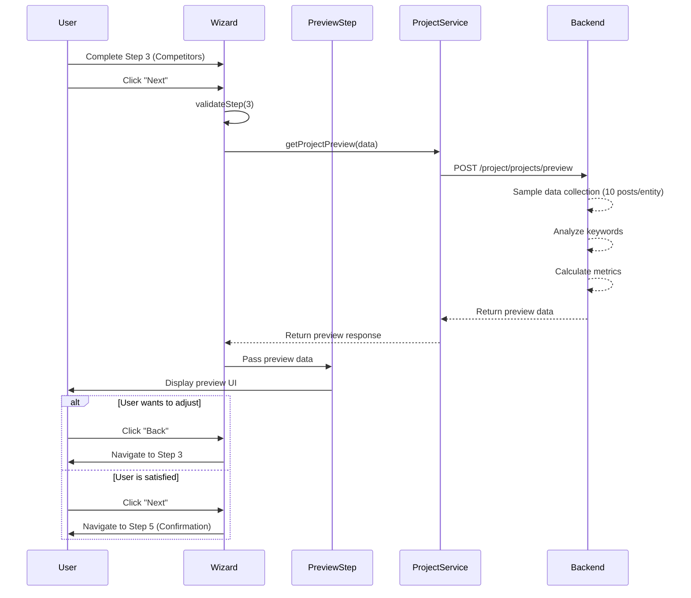

# OpenSpec: Project Preview & Dry Run Feature

**Status:** Proposal
**Created:** 2024-12-11
**Author:** Development Team
**Priority:** High

---

## 1. Overview

### 1.1 Purpose
Implement a preview/dry run feature that allows users to see a sample of collected data before creating a full project. This helps users validate their configuration (brands, competitors, keywords, date range) and understand what data will be collected.

### 1.2 Problem Statement
Currently, users must create a full project and wait for execution to see results. This creates several issues:
- Users cannot validate their keyword choices before committing
- No visibility into data quality or volume before project creation
- Wasted resources on misconfigured projects
- Poor user experience due to lack of feedback

### 1.3 Goals
- Allow users to preview sample data before creating a project
- Validate keyword effectiveness and data availability
- Improve user confidence in project configuration
- Reduce failed or misconfigured projects
- Provide estimated metrics (post count, engagement, etc.)

---

## 2. User Flow

### 2.1 Current Flow
```
Step 1: Basic Info → Step 2: Brand Setup → Step 3: Competitors → Step 4: Confirmation → Create Project
```

### 2.2 Proposed Flow
```
Step 1: Basic Info → Step 2: Brand Setup → Step 3: Competitors → Step 4: Preview (NEW) → Step 5: Confirmation → Create Project
```

### 2.3 Detailed Preview Flow

1. **User completes Step 3 (Competitors)**
2. **User clicks "Next" → Navigate to Step 4 (Preview)**
3. **System shows loading state** while fetching preview data
4. **System displays preview results:**
   - Sample posts (5-10 items per brand/competitor)
   - Key metrics summary
   - Data availability indicators
   - Keyword effectiveness scores
5. **User can:**
   - Review preview data
   - Go back to adjust configuration
   - Proceed to confirmation
6. **User clicks "Next" → Navigate to Step 5 (Final Confirmation)**
7. **User confirms → Create and execute project**

---

## 3. Technical Specification

### 3.1 New API Endpoint (Backend Required)

#### Endpoint: POST `/project/projects/preview`

**Request Payload:**
```typescript
interface ProjectPreviewRequest {
  name: string
  description: string
  brand_name: string
  brand_keywords: string[]
  competitors: Array<{
    name: string
    keywords: string[]
  }>
  from_date: string  // "YYYY-MM-DD HH:mm:ss"
  to_date: string    // "YYYY-MM-DD HH:mm:ss"
  sample_size?: number  // Optional, default: 10 posts per entity
}
```

**Response Schema:**
```typescript
interface ProjectPreviewResponse {
  error_code: number
  message: string
  data: {
    preview_id: string  // Temporary preview session ID
    brand_preview: {
      name: string
      keywords: string[]
      sample_posts: PreviewPost[]
      metrics: PreviewMetrics
      keyword_analysis: KeywordAnalysis[]
    }
    competitors_preview: Array<{
      name: string
      keywords: string[]
      sample_posts: PreviewPost[]
      metrics: PreviewMetrics
      keyword_analysis: KeywordAnalysis[]
    }>
    overall_summary: {
      total_posts_found: number
      date_coverage: {
        from: string
        to: string
        days_with_data: number
        days_without_data: number
      }
      data_quality_score: number  // 0-100
      estimated_full_data_size: number
    }
    warnings: string[]  // e.g., "Low data for competitor X", "Keyword Y has no results"
  }
}

interface PreviewPost {
  id: string
  title?: string
  content: string
  author: string
  published_at: string
  platform: 'facebook' | 'twitter' | 'instagram' | 'tiktok' | 'youtube' | 'web'
  engagement: {
    likes?: number
    comments?: number
    shares?: number
    views?: number
  }
  sentiment?: 'positive' | 'neutral' | 'negative'
  matched_keywords: string[]
  url?: string
}

interface PreviewMetrics {
  total_posts: number
  avg_engagement: number
  sentiment_distribution: {
    positive: number
    neutral: number
    negative: number
  }
  top_platforms: Array<{
    platform: string
    count: number
    percentage: number
  }>
  engagement_trend: 'increasing' | 'stable' | 'decreasing'
}

interface KeywordAnalysis {
  keyword: string
  posts_found: number
  avg_engagement: number
  effectiveness_score: number  // 0-100
  suggestion?: string  // e.g., "Try adding related keywords"
}
```

**Error Responses:**
```typescript
// 400 Bad Request - Invalid parameters
{
  error_code: 400,
  message: "Invalid date range or missing required fields",
  data: null
}

// 503 Service Unavailable - Preview service timeout
{
  error_code: 503,
  message: "Preview service is temporarily unavailable",
  data: null
}
```

---

### 3.2 Frontend Implementation

#### 3.2.1 New Component: `ProjectPreviewStep.tsx`

**Location:** `components/dashboard/ProjectPreviewStep.tsx`

**Component Structure:**
```tsx
interface ProjectPreviewStepProps {
  projectData: ProjectData
  onBack: () => void
  onNext: () => void
}

export default function ProjectPreviewStep({
  projectData,
  onBack,
  onNext
}: ProjectPreviewStepProps) {
  // Component implementation
}
```

**Key Features:**
- Loading state with skeleton UI
- Error handling with retry option
- Tabbed interface (Brand / Competitors)
- Sample posts preview
- Metrics visualization
- Keyword effectiveness indicators
- Warning/alert display
- Back/Next navigation

#### 3.2.2 Update: `ProjectSetupWizard.tsx`

**Changes Required:**

1. **Add new step to steps array:**
```typescript
const steps = [
  { id: 1, title: 'Thông tin cơ bản', description: 'Đặt tên và mô tả project' },
  { id: 2, title: 'Thương hiệu của bạn', description: 'Thêm thương hiệu cần theo dõi' },
  { id: 3, title: 'Đối thủ cạnh tranh', description: 'Thêm các đối thủ để so sánh' },
  { id: 4, title: 'Xem trước dữ liệu', description: 'Kiểm tra mẫu dữ liệu thu thập được' }, // NEW
  { id: 5, title: 'Xác nhận', description: 'Kiểm tra và tạo project' }
]
```

2. **Add preview state:**
```typescript
const [previewData, setPreviewData] = useState<ProjectPreviewResponse | null>(null)
const [isLoadingPreview, setIsLoadingPreview] = useState(false)
const [previewError, setPreviewError] = useState<string | null>(null)
```

3. **Update step navigation logic:**
```typescript
const handleNext = async () => {
  if (validateStep(currentStep)) {
    // If moving from step 3 to step 4, fetch preview
    if (currentStep === 3) {
      await fetchPreviewData()
    }
    setCurrentStep(prev => Math.min(prev + 1, steps.length))
  }
}
```

4. **Add preview fetch function:**
```typescript
const fetchPreviewData = async () => {
  setIsLoadingPreview(true)
  setPreviewError(null)

  try {
    const preview = await projectService.getProjectPreview({
      name: projectData.name,
      description: projectData.description,
      brands: projectData.brands,
      competitors: projectData.competitors,
      fromDate: projectData.fromDate,
      toDate: projectData.toDate,
      sampleSize: 10
    })

    setPreviewData(preview)
  } catch (error: any) {
    setPreviewError(error.message || 'Không thể tải dữ liệu xem trước')
    console.error('Preview fetch error:', error)
  } finally {
    setIsLoadingPreview(false)
  }
}
```

5. **Update render logic to include new step:**
```tsx
{currentStep === 4 && (
  <ProjectPreviewStep
    projectData={projectData}
    previewData={previewData}
    isLoading={isLoadingPreview}
    error={previewError}
    onRetry={fetchPreviewData}
    onBack={handlePrevious}
    onNext={handleNext}
  />
)}
```

#### 3.2.3 Update: `lib/api/services/project.service.ts`

**Add new service method:**
```typescript
export interface GetProjectPreviewPayload {
  name: string
  description: string
  brands: Omit<Brand, 'id'>[]
  competitors: Omit<Brand, 'id'>[]
  fromDate: string
  toDate: string
  sampleSize?: number
}

export const projectService = {
  // ... existing methods ...

  // Get project preview (dry run)
  getProjectPreview: async (
    payload: GetProjectPreviewPayload
  ): Promise<ProjectPreviewResponse> => {
    const apiPayload = {
      ...transformToApiPayload(payload),
      sample_size: payload.sampleSize || 10
    }

    const response = await apiClient.post<ProjectPreviewResponse>(
      '/project/projects/preview',
      apiPayload
    )

    return response.data.data
  },
}
```

---

## 4. UI/UX Design

### 4.1 Preview Step Layout

```
┌─────────────────────────────────────────────────────────────┐
│  Step 4 of 5: Xem trước dữ liệu                              │
│  ─────────────────────────────────────────────────────────  │
│                                                               │
│  🔍 Đang tải mẫu dữ liệu...  [Progress Bar]                  │
│                                                               │
│  ┌──────────────────────────────────────────────────────┐   │
│  │  📊 Tổng quan                                         │   │
│  │  ───────────────────────────────────────────────────│   │
│  │  • Tổng số bài đăng: 1,234                          │   │
│  │  • Phạm vi ngày: 2024-01-01 → 2024-03-31            │   │
│  │  • Chất lượng dữ liệu: ⭐⭐⭐⭐ (85/100)             │   │
│  │  • Ước tính dữ liệu đầy đủ: ~50,000 posts           │   │
│  └──────────────────────────────────────────────────────┘   │
│                                                               │
│  ⚠️ Cảnh báo:                                                │
│  • Từ khóa "example" có ít kết quả (3 posts)                │
│  • Đối thủ "CompetitorX" không có dữ liệu từ 2024-02-15     │
│                                                               │
│  ┌─────────────────────────────────────────────────────┐    │
│  │  [Thương hiệu của bạn] [Đối thủ cạnh tranh (3)]    │    │
│  └─────────────────────────────────────────────────────┘    │
│                                                               │
│  📱 VinFast (Thương hiệu)                                    │
│  ─────────────────────────────────────────────────────────  │
│  • Tìm thấy: 450 posts                                       │
│  • Engagement trung bình: 1,250                              │
│  • Sentiment: 60% Positive, 30% Neutral, 10% Negative       │
│                                                               │
│  🔑 Phân tích từ khóa:                                       │
│  ┌──────────────────────────────────────────────────────┐   │
│  │ "vinfast"    ⭐⭐⭐⭐⭐ (450 posts, high engagement) │   │
│  │ "vf8"        ⭐⭐⭐⭐   (120 posts, good engagement)  │   │
│  │ "xe điện"    ⭐⭐⭐     (80 posts, moderate)          │   │
│  └──────────────────────────────────────────────────────┘   │
│                                                               │
│  📄 Mẫu bài đăng (5):                                        │
│  ┌──────────────────────────────────────────────────────┐   │
│  │ 👤 Nguyễn Văn A • Facebook • 2024-03-15             │   │
│  │ "Trải nghiệm VinFast VF8 thật tuyệt vời! #vinfast  │   │
│  │  #electriccar"                                       │   │
│  │ 👍 1,234  💬 56  ↗️ 89                              │   │
│  │ Sentiment: 😊 Positive • Keywords: vinfast, vf8     │   │
│  └──────────────────────────────────────────────────────┘   │
│  [+ 4 more posts...]                                         │
│                                                               │
│  [← Quay lại]                          [Tiếp tục →]         │
└─────────────────────────────────────────────────────────────┘
```

### 4.2 Design Tokens (Neobrutalism Theme)

```typescript
// Colors
const previewColors = {
  background: 'bg-white/60 dark:bg-gray-900/60',
  border: 'border-amber-300/60 dark:border-white/20',
  cardBg: 'bg-amber-50/50 dark:bg-gray-800/50',

  // Status colors
  success: 'bg-green-100 dark:bg-green-900/40 text-green-800 dark:text-green-300',
  warning: 'bg-yellow-100 dark:bg-yellow-900/40 text-yellow-800 dark:text-yellow-300',
  error: 'bg-red-100 dark:bg-red-900/40 text-red-800 dark:text-red-300',

  // Sentiment colors
  positive: 'text-green-600 dark:text-green-400',
  neutral: 'text-gray-600 dark:text-gray-400',
  negative: 'text-red-600 dark:text-red-400',
}

// Shadows
const previewShadows = {
  card: 'shadow-brutal dark:shadow-brutal-navy',
  metric: 'shadow-brutal-lg',
}

// Animations
const previewAnimations = {
  fadeIn: {
    initial: { opacity: 0, y: 20 },
    animate: { opacity: 1, y: 0 },
    transition: { duration: 0.3 }
  },
  slideIn: {
    initial: { opacity: 0, x: -20 },
    animate: { opacity: 1, x: 0 },
    transition: { duration: 0.3 }
  }
}
```

### 4.3 Component Breakdown

#### 4.3.1 PreviewOverview
- Total posts count with icon
- Date range display
- Data quality score (star rating)
- Estimated full data size
- Visual progress indicators

#### 4.3.2 PreviewWarnings
- Alert box with warning icon
- List of warnings/issues
- Actionable suggestions
- Color-coded severity (warning/error)

#### 4.3.3 PreviewTabs
- Tab navigation (Brand / Competitors)
- Active tab indicator
- Tab counts (e.g., "Competitors (3)")

#### 4.3.4 EntityPreview
- Entity name and type badge
- Metrics cards (posts, engagement, sentiment)
- Keyword analysis table
- Sample posts list
- Platform distribution chart

#### 4.3.5 KeywordAnalysisCard
- Keyword name
- Effectiveness score (stars)
- Posts count
- Average engagement
- Suggestions (if any)

#### 4.3.6 SamplePostCard
- Author and platform info
- Post content (truncated)
- Engagement metrics (likes, comments, shares)
- Sentiment indicator
- Matched keywords tags
- Published date
- Link to original (if available)

#### 4.3.7 LoadingState
- Skeleton UI for all sections
- Animated shimmer effect
- Progress text ("Đang phân tích từ khóa...", "Đang thu thập mẫu dữ liệu...")

#### 4.3.8 ErrorState
- Error icon and message
- Retry button
- Back to edit button
- Support link (optional)

---

## 5. Data Flow



---

## 6. Implementation Plan

### Phase 1: Backend API Development (Backend Team)
**Duration:** 5-7 days

- [ ] Design preview data collection logic
- [ ] Implement `/project/projects/preview` endpoint
- [ ] Add sample data fetching (limited to N posts per entity)
- [ ] Implement keyword analysis algorithm
- [ ] Calculate metrics and scores
- [ ] Add data quality assessment
- [ ] Write unit tests
- [ ] API documentation

### Phase 2: Frontend Component Development
**Duration:** 5-7 days

**Week 1:**
- [ ] Create `ProjectPreviewStep.tsx` component structure
- [ ] Implement loading state with skeleton UI
- [ ] Create sub-components:
  - [ ] PreviewOverview
  - [ ] PreviewWarnings
  - [ ] PreviewTabs
  - [ ] EntityPreview

**Week 2:**
- [ ] Create additional sub-components:
  - [ ] KeywordAnalysisCard
  - [ ] SamplePostCard
  - [ ] ErrorState
- [ ] Update `ProjectSetupWizard.tsx`
- [ ] Add `getProjectPreview` to project service
- [ ] Implement state management
- [ ] Add error handling and retry logic

### Phase 3: Integration & Testing
**Duration:** 3-4 days

- [ ] Integrate preview step into wizard flow
- [ ] Test with various data scenarios
- [ ] Test error cases (no data, timeout, etc.)
- [ ] Test with different date ranges
- [ ] Test keyword effectiveness calculation
- [ ] Cross-browser testing
- [ ] Mobile responsiveness testing

### Phase 4: Refinement & Polish
**Duration:** 2-3 days

- [ ] UI/UX refinements based on feedback
- [ ] Performance optimization
- [ ] Accessibility improvements
- [ ] i18n translations (Vietnamese/English)
- [ ] Documentation updates
- [ ] Demo preparation

---

## 7. Acceptance Criteria

### 7.1 Functional Requirements

✅ **Preview Data Display**
- [ ] Shows sample posts from brand and all competitors
- [ ] Displays key metrics (total posts, engagement, sentiment)
- [ ] Shows keyword effectiveness analysis
- [ ] Provides data quality score
- [ ] Estimates full dataset size

✅ **User Interaction**
- [ ] User can navigate back to edit configuration
- [ ] User can proceed to final confirmation
- [ ] User can retry if preview fails
- [ ] User can switch between brand and competitor tabs

✅ **Error Handling**
- [ ] Graceful handling of API errors
- [ ] Clear error messages
- [ ] Retry mechanism for transient failures
- [ ] Fallback to confirmation if preview unavailable

✅ **Performance**
- [ ] Preview loads within 10 seconds
- [ ] Smooth animations and transitions
- [ ] No UI blocking during data load

### 7.2 Non-Functional Requirements

✅ **Usability**
- [ ] Clear visual hierarchy
- [ ] Intuitive navigation
- [ ] Helpful tooltips and guidance
- [ ] Accessible to screen readers

✅ **Consistency**
- [ ] Follows existing design system (Neobrutalism)
- [ ] Consistent with other wizard steps
- [ ] Matches project naming conventions

✅ **Internationalization**
- [ ] All text supports i18n
- [ ] Date formatting respects locale
- [ ] Number formatting respects locale

---

## 8. Risks & Mitigation

### Risk 1: Preview API Timeout
**Impact:** High
**Probability:** Medium
**Mitigation:**
- Implement 15-second timeout
- Show partial results if available
- Provide skip preview option
- Cache preview results temporarily

### Risk 2: Inconsistent Preview vs Full Data
**Impact:** Medium
**Probability:** Medium
**Mitigation:**
- Clearly label as "sample" data
- Show confidence intervals
- Add disclaimer about variations
- Use consistent sampling algorithm

### Risk 3: High Backend Load
**Impact:** Medium
**Probability:** Low
**Mitigation:**
- Rate limiting on preview endpoint
- Cache common keyword searches
- Limit sample size per request
- Implement request queuing

### Risk 4: User Confusion
**Impact:** Low
**Probability:** Low
**Mitigation:**
- Clear explanatory text
- Tooltips for metrics
- Help documentation
- User onboarding guide

---

## 9. Success Metrics

### 9.1 User Metrics
- **Preview Usage Rate:** Target 80%+ of project creations use preview
- **Configuration Changes:** Track how often users go back to edit after preview
- **Successful Project Rate:** Measure reduction in failed/misconfigured projects

### 9.2 Technical Metrics
- **Preview API Response Time:** Target <10 seconds (p95)
- **Preview Error Rate:** Target <5%
- **Preview Accuracy:** Sample data should correlate 90%+ with full data

### 9.3 Business Metrics
- **User Satisfaction:** Survey after implementation
- **Support Tickets:** Measure reduction in configuration-related issues
- **Feature Adoption:** Track usage over time

---

## 10. Future Enhancements

### 10.1 Short-term (Next Sprint)
- Add download preview report (PDF/CSV)
- Implement preview result sharing (shareable link)
- Add comparison view (side-by-side competitors)

### 10.2 Medium-term (Next Quarter)
- Historical preview comparison
- AI-powered keyword suggestions based on preview
- Preview scheduling (run overnight for large datasets)
- Advanced filters (platform, sentiment, date range)

### 10.3 Long-term (Next Year)
- Real-time preview updates
- Interactive data exploration
- Preview analytics dashboard
- A/B testing for keyword combinations

---

## 11. Dependencies

### 11.1 Backend Dependencies
- Backend team must implement preview endpoint first
- Data collection service must support limited sampling
- Keyword analysis algorithm required

### 11.2 Frontend Dependencies
- Existing components: ProjectSetupWizard, MetricCard
- Chart.js for data visualization
- SweetAlert2 for notifications
- Framer Motion for animations

### 11.3 External Dependencies
- Backend API availability
- Data sources (social media APIs) uptime
- Browser support (modern browsers only)

---

## 12. Rollout Plan

### 12.1 Development Environment
- Deploy to dev environment
- Internal team testing
- Bug fixes and refinements

### 12.2 Staging Environment
- Deploy to staging
- QA testing
- Performance testing
- Security review

### 12.3 Production Rollout
**Strategy:** Phased rollout with feature flag

**Week 1:** 10% of users (beta testers)
- Monitor metrics
- Gather feedback
- Fix critical issues

**Week 2:** 50% of users
- Broader testing
- Performance monitoring
- A/B testing (preview vs no preview)

**Week 3:** 100% of users
- Full rollout
- Remove feature flag
- Update documentation

---

## 13. Documentation

### 13.1 User Documentation
- [ ] Update user guide with preview step instructions
- [ ] Create video tutorial
- [ ] Add FAQ section
- [ ] Write blog post announcement

### 13.2 Technical Documentation
- [ ] API endpoint documentation
- [ ] Component API documentation
- [ ] Architecture decision record
- [ ] Troubleshooting guide

### 13.3 Training Materials
- [ ] Internal team training
- [ ] Support team training
- [ ] Sales team demo materials

---

## 14. Appendix

### 14.1 Example Preview Scenarios

**Scenario A: High Quality Data**
- Brand has 500+ posts with good engagement
- All keywords performing well
- Competitors have adequate data
- **Result:** Green indicators, proceed with confidence

**Scenario B: Low Data Warning**
- Brand has <50 posts in date range
- Some keywords have 0 results
- One competitor has no data
- **Result:** Yellow warnings, suggest adjustments

**Scenario C: Critical Issues**
- No data found for brand
- All keywords ineffective
- Date range has data gap
- **Result:** Red alerts, must adjust configuration

### 14.2 Keyword Effectiveness Scoring Algorithm

```
Score = (
  Posts Found Weight (40%) * normalize(posts_count) +
  Engagement Weight (30%) * normalize(avg_engagement) +
  Recency Weight (20%) * recency_factor +
  Diversity Weight (10%) * platform_diversity
)

Where:
- normalize() scales value to 0-100 range
- recency_factor = posts in last 30 days / total posts
- platform_diversity = unique platforms / total platforms
```

### 14.3 Translation Keys (i18n)

```json
{
  "preview": {
    "title": "Xem trước dữ liệu",
    "loading": "Đang tải mẫu dữ liệu...",
    "overview": "Tổng quan",
    "warnings": "Cảnh báo",
    "brandTab": "Thương hiệu của bạn",
    "competitorsTab": "Đối thủ cạnh tranh",
    "totalPosts": "Tổng số bài đăng",
    "dateRange": "Phạm vi ngày",
    "dataQuality": "Chất lượng dữ liệu",
    "estimatedSize": "Ước tính dữ liệu đầy đủ",
    "keywordAnalysis": "Phân tích từ khóa",
    "samplePosts": "Mẫu bài đăng",
    "engagement": "Tương tác",
    "sentiment": "Cảm xúc",
    "retry": "Thử lại",
    "skipPreview": "Bỏ qua xem trước"
  }
}
```

---

## 15. Sign-off

**Product Owner:** _____________________ Date: _______

**Tech Lead:** _____________________ Date: _______

**Design Lead:** _____________________ Date: _______

**QA Lead:** _____________________ Date: _______
